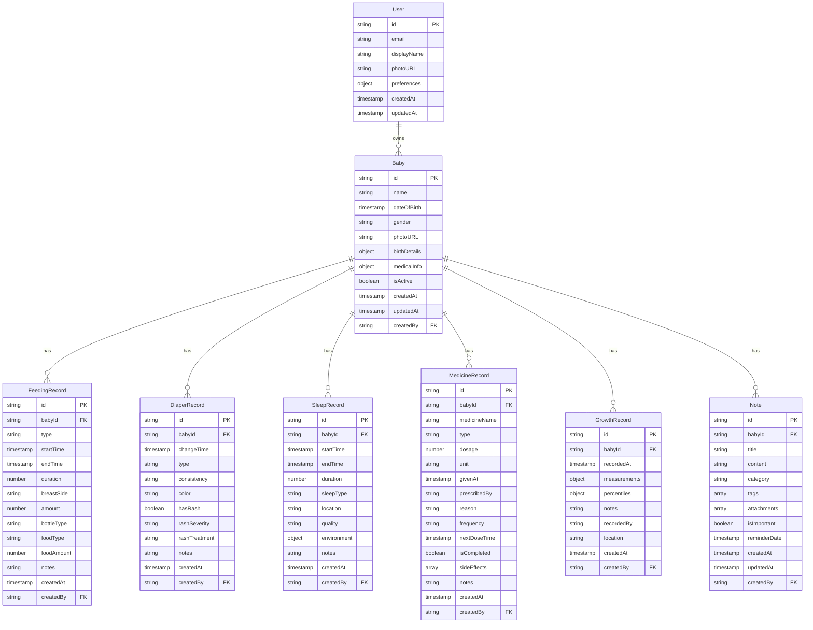

# Pegki Baby Care - Database Schema & Architecture

## Overview
This document outlines the Firestore database schema, data relationships, and architectural decisions for the Pegki Baby Care application.

## Database Technology
- **Primary Database**: Google Cloud Firestore
- **Authentication**: Firebase Authentication
- **Storage**: Firebase Cloud Storage (for photos)
- **Real-time Updates**: Firestore real-time listeners

## Core Principles
1. **User-Centric Design**: All data is associated with authenticated users
2. **Baby-Specific Tracking**: Each baby has their own data isolation
3. **Real-time Sync**: Data syncs across devices in real-time
4. **Offline Support**: Firestore provides offline persistence
5. **Scalable Structure**: Designed to handle multiple babies per user

## Collection Structure

### 1. Users Collection (`/users/{userId}`)
Stores user profile and preferences.

```typescript
interface User {
  id: string;                    // Auto-generated document ID
  email: string;                 // From Firebase Auth
  displayName: string;           // User's full name
  photoURL?: string;             // Profile picture URL
  preferences: {
    timezone: string;            // User's timezone
    units: 'metric' | 'imperial'; // Measurement units
    language: string;            // App language
    notifications: {
      enabled: boolean;
      feedingReminders: boolean;
      medicineReminders: boolean;
      sleepReminders: boolean;
    };
  };
  createdAt: Timestamp;
  updatedAt: Timestamp;
}
```

### 2. Babies Collection (`/users/{userId}/babies/{babyId}`)
Subcollection under each user containing baby profiles.

```typescript
interface Baby {
  id: string;                    // Auto-generated document ID
  name: string;                  // Baby's name
  dateOfBirth: Timestamp;        // Birth date
  gender: 'male' | 'female' | 'other';
  photoURL?: string;             // Baby's photo URL
  birthDetails: {
    weight?: number;             // Birth weight (kg or lbs)
    height?: number;             // Birth height (cm or inches)
    bloodType?: string;          // Blood type
    hospitalName?: string;       // Birth hospital
  };
  medicalInfo: {
    allergies: string[];         // Known allergies
    medications: string[];       // Current medications
    conditions: string[];        // Medical conditions
    doctorName?: string;         // Primary doctor
    doctorPhone?: string;        // Doctor's contact
  };
  isActive: boolean;             // Active baby for tracking
  createdAt: Timestamp;
  updatedAt: Timestamp;
  createdBy: string;             // User ID who created
}
```

### 3. Feeding Records (`/users/{userId}/babies/{babyId}/feedings/{feedingId}`)

```typescript
interface FeedingRecord {
  id: string;
  babyId: string;                // Reference to baby
  type: 'breast' | 'bottle' | 'solid';
  startTime: Timestamp;
  endTime?: Timestamp;           // Optional for ongoing feeds
  duration?: number;             // Calculated duration in minutes
  
  // Breastfeeding specific
  breastSide?: 'left' | 'right' | 'both';
  
  // Bottle feeding specific
  amount?: number;               // Amount in ml/oz
  bottleType?: 'formula' | 'breast_milk' | 'water' | 'juice';
  
  // Solid food specific
  foodType?: string;             // Description of food
  foodAmount?: number;           // Amount in grams/oz
  
  notes?: string;                // Additional notes
  createdAt: Timestamp;
  createdBy: string;             // User ID who logged
}
```

### 4. Diaper Records (`/users/{userId}/babies/{babyId}/diapers/{diaperId}`)

```typescript
interface DiaperRecord {
  id: string;
  babyId: string;
  changeTime: Timestamp;
  type: 'wet' | 'dirty' | 'mixed' | 'dry';
  
  // Additional details for dirty diapers
  consistency?: 'liquid' | 'soft' | 'formed' | 'hard';
  color?: 'yellow' | 'brown' | 'green' | 'black' | 'red-tinged' | 'white';
  
  hasRash: boolean;
  rashSeverity?: 'mild' | 'moderate' | 'severe';
  rashTreatment?: string;        // Treatment applied
  
  notes?: string;
  createdAt: Timestamp;
  createdBy: string;
}
```

### 5. Sleep Records (`/users/{userId}/babies/{babyId}/sleep/{sleepId}`)

```typescript
interface SleepRecord {
  id: string;
  babyId: string;
  startTime: Timestamp;
  endTime?: Timestamp;           // Null for ongoing sleep
  duration?: number;             // Calculated duration in minutes
  sleepType: 'nap' | 'night';    // Determined by time of day
  location: 'crib' | 'bed' | 'stroller' | 'car_seat' | 'other';
  quality: 'excellent' | 'good' | 'fair' | 'poor';
  
  // Sleep environment
  environment: {
    temperature?: number;        // Room temperature
    noiseLevel?: 'quiet' | 'moderate' | 'noisy';
    brightness?: 'dark' | 'dim' | 'bright';
  };
  
  notes?: string;
  createdAt: Timestamp;
  createdBy: string;
}
```

### 6. Medicine Records (`/users/{userId}/babies/{babyId}/medicines/{medicineId}`)

```typescript
interface MedicineRecord {
  id: string;
  babyId: string;
  medicineName: string;
  type: 'liquid' | 'tablet' | 'drops' | 'cream' | 'injection' | 'other';
  dosage: number;
  unit: 'ml' | 'mg' | 'drops' | 'applications';
  givenAt: Timestamp;
  
  // Prescription details
  prescribedBy?: string;         // Doctor's name
  reason?: string;               // Condition being treated
  frequency?: 'once' | 'twice' | 'thrice' | 'four_times' | 'as_needed';
  
  // Next dose scheduling
  nextDoseTime?: Timestamp;
  isCompleted: boolean;          // For scheduled medications
  
  // Side effects and notes
  sideEffects?: string[];
  notes?: string;
  
  createdAt: Timestamp;
  createdBy: string;
}
```

### 7. Growth Records (`/users/{userId}/babies/{babyId}/growth/{growthId}`)

```typescript
interface GrowthRecord {
  id: string;
  babyId: string;
  recordedAt: Timestamp;
  
  measurements: {
    weight?: number;             // kg or lbs
    height?: number;             // cm or inches
    headCircumference?: number;  // cm or inches
  };
  
  // Percentiles (calculated client-side or cloud function)
  percentiles?: {
    weight?: number;             // 0-100
    height?: number;             // 0-100
    headCircumference?: number;  // 0-100
  };
  
  notes?: string;
  recordedBy?: string;           // Healthcare provider name
  location?: string;             // Where measurement was taken
  
  createdAt: Timestamp;
  createdBy: string;
}
```

### 8. Notes Collection (`/users/{userId}/babies/{babyId}/notes/{noteId}`)

```typescript
interface Note {
  id: string;
  babyId: string;
  title: string;
  content: string;
  category: 'milestone' | 'health' | 'behavior' | 'development' | 'general';
  tags: string[];                // For easy filtering
  
  // Media attachments
  attachments?: {
    type: 'photo' | 'video';
    url: string;
    caption?: string;
  }[];
  
  isImportant: boolean;          // Flag for important notes
  reminderDate?: Timestamp;      // Optional reminder
  
  createdAt: Timestamp;
  updatedAt: Timestamp;
  createdBy: string;
}
```

## Data Relationships & Architecture



## Security Rules

```javascript
rules_version = '2';
service cloud.firestore {
  match /databases/{database}/documents {
    // Users can only access their own data
    match /users/{userId} {
      allow read, write: if request.auth != null && request.auth.uid == userId;
      
      // Baby data is nested under users
      match /babies/{babyId} {
        allow read, write: if request.auth != null && request.auth.uid == userId;
        
        // All baby-related collections
        match /{collection}/{documentId} {
          allow read, write: if request.auth != null && request.auth.uid == userId;
        }
      }
    }
    
    // Deny access to all other documents
    match /{document=**} {
      allow read, write: if false;
    }
  }
}
```

## Indexing Strategy

### Composite Indexes
```javascript
// For feeding records - query by baby and date range
babyId ASC, startTime DESC

// For diaper records - query by baby and date range  
babyId ASC, changeTime DESC

// For sleep records - query by baby and date range
babyId ASC, startTime DESC

// For medicine records - query by baby and completion status
babyId ASC, isCompleted ASC, nextDoseTime ASC

// For growth records - query by baby and date
babyId ASC, recordedAt DESC

// For notes - query by baby, category and importance
babyId ASC, category ASC, isImportant DESC, createdAt DESC
```

## Data Access Patterns

### 1. Dashboard Queries
- Get today's feeding count for baby
- Get last diaper change time
- Get current sleep status
- Get upcoming medicine doses

### 2. Historical Data
- Get feeding history for date range
- Get diaper pattern analysis
- Get sleep trends over time
- Get growth chart data

### 3. Real-time Updates
- Live feeding timer
- Sleep session tracking
- Medicine reminder notifications

## Offline Support
Firestore provides automatic offline support with:
- Local data persistence
- Automatic sync when online
- Conflict resolution for concurrent edits

## Data Validation

### Client-Side Validation
- Required fields validation
- Data type validation
- Date range validation (e.g., birth date not in future)
- Dosage limits for medicines

### Server-Side Validation (Cloud Functions)
- Business logic validation
- Data consistency checks
- Automatic calculations (duration, percentiles)
- Push notification triggers

## Performance Considerations

### Best Practices
1. **Pagination**: Use cursor-based pagination for large datasets
2. **Caching**: Cache frequently accessed data locally
3. **Batch Operations**: Use batch writes for related operations
4. **Selective Queries**: Only fetch required fields
5. **Connection Management**: Manage real-time listeners properly

### Data Limits
- Document size: Max 1MB
- Collection depth: Max 100 levels
- Field names: Max 1500 bytes
- Array elements: Max 20,000

## Migration Strategy

### Phase 1: Core Collections
- Users
- Babies  
- Basic feeding/diaper/sleep records

### Phase 2: Enhanced Features
- Medicine tracking
- Growth records
- Rich notes with attachments

### Phase 3: Advanced Analytics
- Trend analysis
- Predictive insights
- Export capabilities

## Backup & Recovery
- Firestore automatic backups
- Export to Cloud Storage
- Data export APIs for user data portability

This schema provides a solid foundation for the baby care app with proper data isolation, security, and scalability considerations.