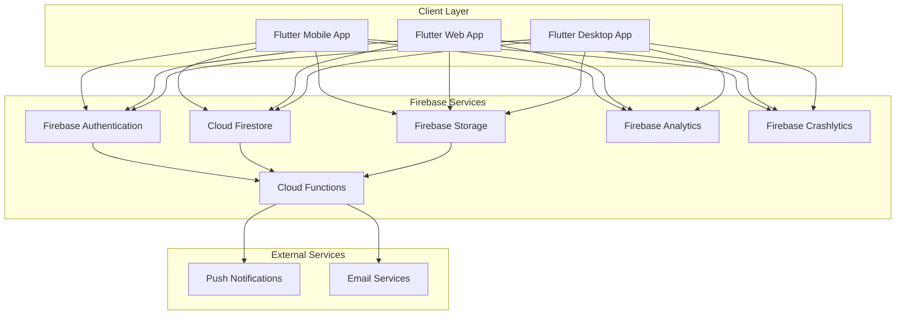
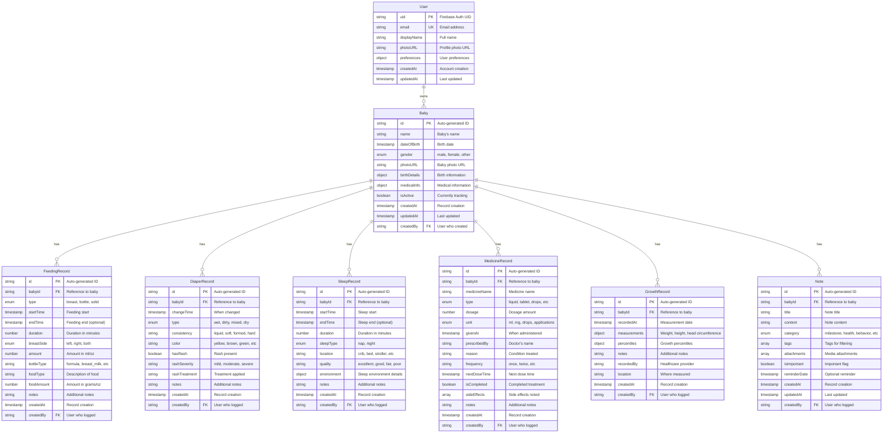
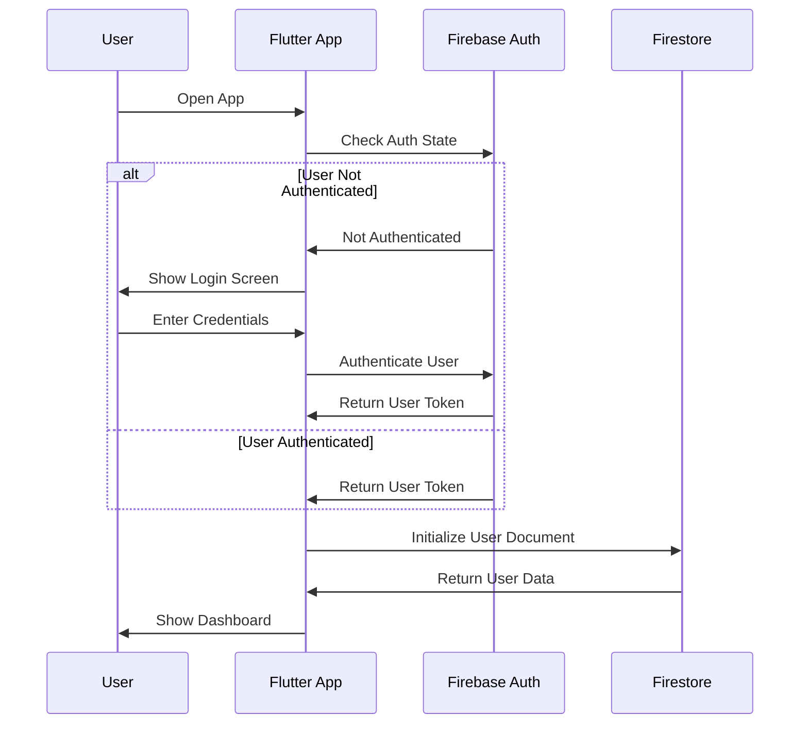
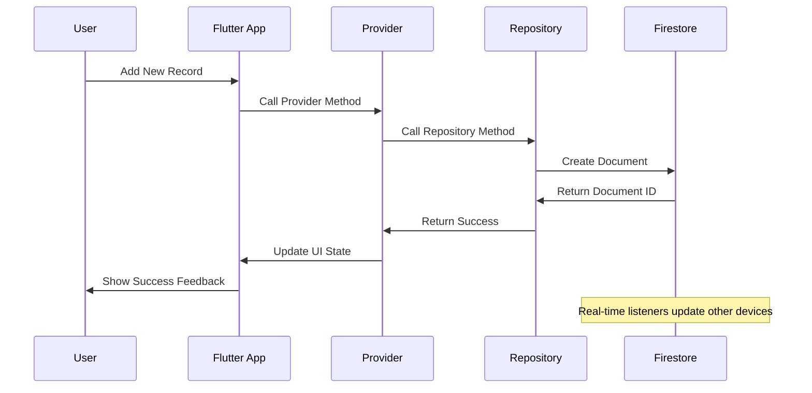
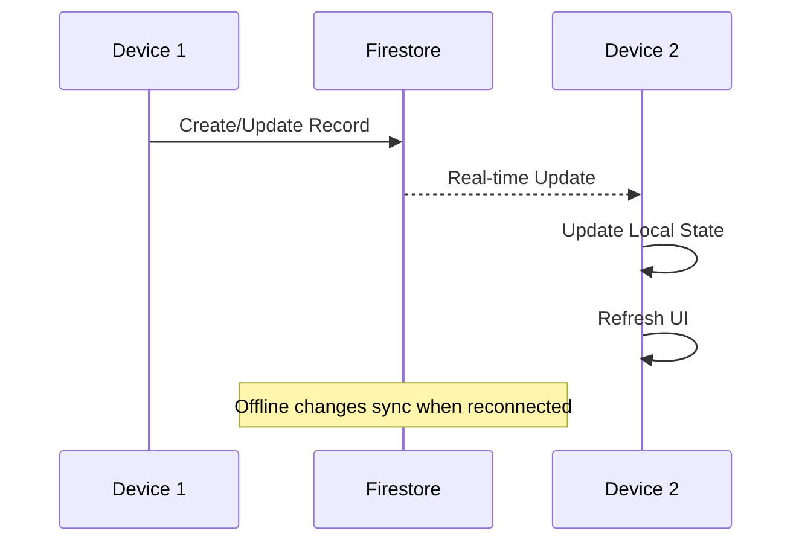

# Pegki Baby Care - Data Architecture & UML Design

## Executive Summary
This document provides a comprehensive overview of the data architecture for the Pegki Baby Care application, including UML diagrams, data flow patterns, and technical implementation details.

## System Architecture Overview



## Database Schema UML Diagram



## Data Flow Diagrams

### 1. User Authentication Flow



### 2. Data Creation Flow



### 3. Real-time Data Sync



## Collection Structure Hierarchy

```
/users/{userId}
├── /babies/{babyId}
│   ├── /feedings/{feedingId}
│   ├── /diapers/{diaperId}
│   ├── /sleep/{sleepId}
│   ├── /medicines/{medicineId}
│   ├── /growth/{growthId}
│   └── /notes/{noteId}
└── (user document fields)
```

## Data Access Patterns

### Read Operations

1. **Dashboard Data Loading**
   ```typescript
   // Load today's summary for all activities
   const today = startOfDay(new Date());
   const tomorrow = addDays(today, 1);
   
   // Parallel queries for better performance
   Promise.all([
     getFeedingsInRange(babyId, today, tomorrow),
     getDiapersInRange(babyId, today, tomorrow),
     getSleepInRange(babyId, today, tomorrow),
     getMedicinesDueToday(babyId, today, tomorrow)
   ]);
   ```

2. **Historical Data Analysis**
   ```typescript
   // Load data for date range analysis
   const weekData = await Promise.all([
     getFeedingsInRange(babyId, startDate, endDate),
     getDiapersInRange(babyId, startDate, endDate),
     getSleepInRange(babyId, startDate, endDate)
   ]);
   ```

3. **Real-time Monitoring**
   ```typescript
   // Active sleep session tracking
   const activeSleepQuery = query(
     collection(db, `users/${userId}/babies/${babyId}/sleep`),
     where('endTime', '==', null),
     orderBy('startTime', 'desc'),
     limit(1)
   );
   ```

### Write Operations

1. **Batch Operations**
   ```typescript
   // Update multiple related records atomically
   const batch = writeBatch(db);
   batch.set(feedingRef, feedingData);
   batch.update(babyRef, { lastFed: feedingData.startTime });
   await batch.commit();
   ```

2. **Optimistic Updates**
   ```typescript
   // Update UI immediately, rollback on error
   provider.addOptimisticUpdate(newRecord);
   try {
     await repository.create(newRecord);
   } catch (error) {
     provider.rollbackOptimisticUpdate(newRecord.id);
     throw error;
   }
   ```

## Security Model

### Data Isolation
- Each user can only access their own data
- Baby data is isolated under user collections
- All operations require authentication

### Permission Levels
```typescript
interface SecurityRules {
  users: {
    read: "own_data_only",
    write: "own_data_only"
  },
  babies: {
    read: "parent_only",
    write: "parent_only",
    create: "authenticated_users"
  },
  records: {
    read: "baby_parent_only",
    write: "baby_parent_only",
    create: "baby_parent_only"
  }
}
```

## Performance Optimization

### Indexing Strategy
1. **Single Field Indexes**: Automatic for all fields
2. **Composite Indexes**: Optimized for common queries
3. **Collection Group Queries**: Enabled for cross-baby analytics

### Caching Strategy
1. **Local Storage**: Critical data cached locally
2. **Memory Cache**: Frequently accessed data
3. **Image Caching**: Baby photos and attachments

### Query Optimization
1. **Pagination**: Cursor-based pagination for large datasets
2. **Selective Loading**: Only load required fields
3. **Batch Loading**: Group related queries

## Data Validation

### Client-side Validation
```typescript
interface ValidationRules {
  required: string[];
  types: Record<string, string>;
  constraints: Record<string, any>;
  custom: Record<string, Function>;
}
```

### Server-side Validation
- Firestore security rules validate data structure
- Cloud Functions perform business logic validation
- Data integrity checks prevent corruption

## Migration & Versioning

### Schema Evolution
1. **Backward Compatibility**: New fields are optional
2. **Data Migration**: Cloud Functions handle migrations
3. **Version Control**: Schema versions tracked

### Migration Process
```typescript
// Example migration function
export const migrateBabyData = functions.firestore
  .document('users/{userId}/babies/{babyId}')
  .onWrite(async (change, context) => {
    const newData = change.after.data();
    if (!newData.schemaVersion || newData.schemaVersion < CURRENT_VERSION) {
      // Perform migration
      await migrateToCurrentSchema(change.after.ref, newData);
    }
  });
```

## Analytics & Monitoring

### Key Metrics
1. **User Engagement**: Daily/Monthly active users
2. **Feature Usage**: Track which features are used most
3. **Performance**: Query execution times
4. **Errors**: Track and alert on errors

### Data Export
1. **User Data Export**: GDPR compliance
2. **Analytics Export**: Business intelligence
3. **Backup Export**: Disaster recovery

## Future Considerations

### Scalability
- Sharding strategy for large user bases
- Read replicas for improved performance
- CDN for media content

### Advanced Features
- Machine learning insights
- Predictive analytics
- Multi-baby household support
- Healthcare provider integration

### Compliance
- HIPAA compliance for health data
- GDPR compliance for EU users
- Data retention policies
- Privacy controls

This data architecture provides a robust foundation for the Pegki Baby Care application while maintaining flexibility for future enhancements and ensuring data security and privacy.